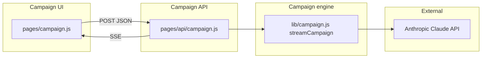

# ViralOS — Design & Architecture Index

> **Code HEAD**: `50d96cc` · Updated 2026-05-27  
> **Shipped product**: viral campaign generator (`/campaign`, `POST /api/campaign`)

This page is the **entry point** for ViralOS system design. Three companion documents cover architecture, interaction, and internal control/data flow:

| Document | Question it answers |
|----------|-------------------|
| **[system-design-architecture.md](./system-design-architecture.md)** | **What** is the system? Layers, components, deployment, boundaries |
| **[system-interaction-design.md](./system-interaction-design.md)** | **How** do parts interact? Journeys, sequences, API contracts |
| **[system-control-data-flow.md](./system-control-data-flow.md)** | **How** does control & data move inside each component? Agent pipeline, SSE events, transforms |

**Vision-only (not shipped):** Personal Cognitive OS — see [cognitive-os-mvp-canonical.md](./cognitive-os-mvp-canonical.md) and hci-* docs.

---

## 1. One-line summary

**ViralOS** runs a **sequential three-agent pipeline** (Market Analyst → Content Writer → Growth Optimizer) on the server, streams progress over **SSE**, and returns a unified campaign package with persona, multi-platform content, and Viral Score™.

---

## 2. Component map



| Component | Responsibility | Primary path |
|-----------|----------------|--------------|
| **Campaign UI** | Form input, SSE consumer, result display | `pages/campaign.js` |
| **Campaign API** | Auth env check, SSE framing, error envelope | `pages/api/campaign.js` |
| **Campaign engine** | Agent orchestration, JSON parse, aggregation | `lib/campaign.js` |
| **Proxy layer** (optional) | Forward to DataproAI / stock backends | `lib/proxy.js`, `pages/api/*` |
| **Anthropic** | LLM inference | `@anthropic-ai/sdk` |

---

## 3. Layered architecture (summary)

```text
┌────────────────────────────────────────────────────────────┐
│ Presentation — React (Pages Router) · / · /campaign        │
├────────────────────────────────────────────────────────────┤
│ API — pages/api/campaign.js (GET info · POST SSE)          │
├────────────────────────────────────────────────────────────┤
│ Domain — lib/campaign.js (3-agent sequential pipeline)     │
├────────────────────────────────────────────────────────────┤
│ External — Anthropic Messages API (claude-sonnet-4-…)      │
└────────────────────────────────────────────────────────────┘
```

Optional proxy routes sit beside the campaign stack and require `API_PROXY_BASE_URL`.

---

## 4. Primary user flow

| Flow | Entry | Doc section |
|------|-------|-------------|
| Generate campaign (UI) | `/campaign` | [interaction §3](./system-interaction-design.md#3-user-journey-generate-campaign) |
| Generate campaign (API) | `POST /api/campaign` | [interaction §4](./system-interaction-design.md#4-api-contracts) |
| SDK / script | `@viralOS/sdk` / `examples/` | README · out of repo core path |

Control and data detail: [control/data §2](./system-control-data-flow.md#2-端到端主路径-product--campaign-package).

---

## 5. Deployment

| Target | Stack | Notes |
|--------|-------|-------|
| Vercel | Next.js 14 Pages Router | `ANTHROPIC_API_KEY` in project env |
| Self-host | `npm run build && npm start` | Same env contract |

Details: [architecture §6](./system-design-architecture.md#6-deployment).

---

## 6. Verification

```bash
npm run verify        # build + unit tests (campaign lib)
npm run verify:full   # + smoke-test against running server
```

Issues and gaps: [issue.md](./issue.md) · [todo.md](./todo.md).

---

## 7. Related documents

### Core trilogy (onboarding order)

1. [system-design-architecture.md](./system-design-architecture.md)
2. [system-interaction-design.md](./system-interaction-design.md)
3. [system-control-data-flow.md](./system-control-data-flow.md)

### Product boundary & vision

| Topic | Document |
|-------|----------|
| Shipped vs Cognitive OS vision | [README.md](./README.md) |
| Cognitive OS canonical (future) | [cognitive-os-mvp-canonical.md](./cognitive-os-mvp-canonical.md) |
| English overview | [COGNITIVE-OS-EN.md](./COGNITIVE-OS-EN.md) |
