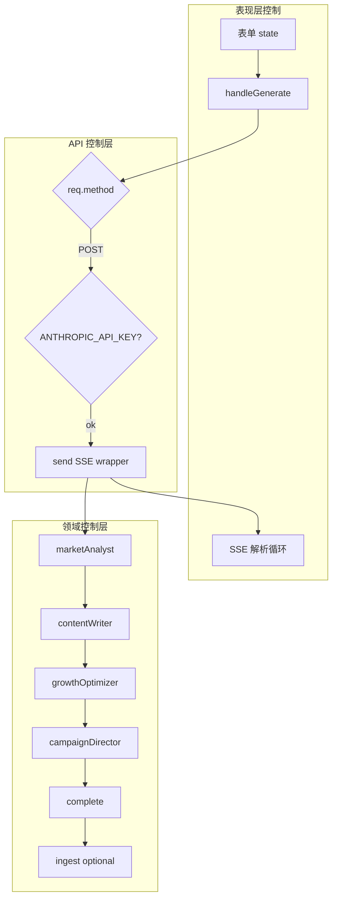
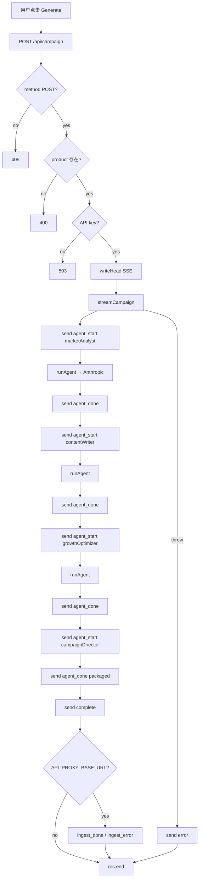

# ViralOS — 系统控制流与数据流设计

> **Version**: 2026-05-27 · **Code HEAD**: `f104bfe`  
> **Companion**: [system-design-architecture.md](./system-design-architecture.md) · [system-interaction-design.md](./system-interaction-design.md) · [DESIGN.md](./DESIGN.md)

本文档说明 **核心组件内部的控制逻辑**（调用顺序、分支、错误处理）与 **数据流**（输入如何变形、在何处下发），与交互文档中的序列图互补。

---

## 1. 核心组件控制职责

| 组件 | 控制主体 | 决策点 |
|------|----------|--------|
| **Campaign UI** | React 事件处理 | 何时 POST、如何解析 SSE、错误展示 |
| **Campaign API** | `handler(req,res)` | Method 分支、env 检查、SSE 头、try/catch |
| **Campaign engine** | `streamCampaign` | 3× LLM Agent + Campaign Director 打包；`real-ai-guard` |
| **Gateway ingest** | `ingestCampaignIfConfigured` | `API_PROXY_BASE_URL` 设置时 POST complete 后 |
| **runAgent** | `messages.create` | JSON 解析成功/失败 |
| **Proxy** | `proxyRequest` | base URL 是否存在、上游状态透传 |



---

## 2. 端到端主路径：Product → Campaign package

### 2.1 控制流



| 阶段 | 控制代码 | 说明 |
|------|----------|------|
| 入口 | `pages/api/campaign.js` | 唯一 campaign HTTP 入口 |
| 编排 | `streamCampaign` | 无分支跳过 Agent；无并行 |
| 单步推理 | `runAgent` | 固定 model `claude-sonnet-4-20250514`, max_tokens 1500 |
| 输出 | `send({ type })` | 同步写入 response stream |
| 终止 | `finally { res.end() }` | 无论成功失败关闭连接 |

**无持久化状态机**：单次请求内完成；无 `pending` / `running` 表。

### 2.2 数据流

```mermaid
flowchart LR
  subgraph Input
    I1[product]
    I2[description audience tone platforms]
  end

  subgraph T1["变换 1: marketAnalyst"]
    M[persona emotionalDrivers competitorGap]
  end

  subgraph T2["变换 2: contentWriter"]
    CT[platform-keyed content object]
  end

  subgraph T3["变换 3: growthOptimizer"]
    G[viralScore scoreBreakdown growthStrategy boostTips timing]
  end

  subgraph Output
    R[complete.result]
    E[SSE events[]]
  end

  I1 --> T1
  I2 --> T1
  M --> T2
  I1 --> T2
  CT --> T3
  I1 --> T3
  T1 --> R
  T2 --> R
  T3 --> R
  T1 --> E
  T2 --> E
  T3 --> E
  R --> E
```

**Prompt 数据依赖**

| Agent | 写入 prompt 的数据 |
|-------|-------------------|
| marketAnalyst | `product`, `description`, `audience` |
| contentWriter | `product`, `description`, `marketData.persona`, `tone`, `platforms[]` |
| growthOptimizer | `product`, `platforms`, `contentData` 前 600 字符 JSON 摘要 |

**`complete.result` 聚合规则**（`lib/campaign.js`）

```javascript
{
  product,                                    // 输入回显
  persona: marketData.persona,
  emotionalDrivers: marketData.emotionalDrivers,
  content: contentData,
  viralScore: growthData.viralScore,
  scoreBreakdown: growthData.scoreBreakdown,
  growthStrategy: growthData.growthStrategy,
  boostTips: growthData.boostTips,
  timing: growthData.timing
}
```

---

## 3. 分组件控制流与数据流

### 3.1 Campaign UI (`pages/campaign.js`)

**控制流**

```text
mount → 用户编辑 state
  → handleGenerate:
      loading=true, clear events/result/error
      → fetch POST
      → if !ok: parse JSON error → setError
      → else: read loop until done
            → parse SSE → setEvents
            → complete → setResult
            → error event → throw
      → finally loading=false
```

**数据流**

| 方向 | 数据 |
|------|------|
| 上行 | `{ product, description, audience, tone, platforms: string[] }` |
| 下行 | `events[]` 全量 SSE 载荷；`result` 仅来自 `complete` |
| 本地 | 无 localStorage / 无服务端 session |

### 3.2 Campaign API (`pages/api/campaign.js`)

**控制流**

| 分支 | 行为 |
|------|------|
| `GET` | 立即 JSON 返回 `CAMPAIGN_API_INFO` |
| `POST` + 校验失败 | JSON 错误，**非** SSE |
| `POST` + 成功 | SSE 流式，`streamCampaign` 驱动 |
| `catch` | `send({ type: 'error', message })` 仍走 SSE |

**数据流**

- 请求体：`req.body`（`bodyParser: true`）
- 响应：仅 SSE 通道写入；无中间 DB

### 3.3 `runAgent`（单 Agent 推理单元）

**控制流**

```text
messages.create(system, user)
  → 拼接 content blocks 为 text
  → strip ```json fences
  → JSON.parse
      ├─ 成功 → return object
      └─ 失败 → return { error: 'Parse failed', raw: text }
```

**数据流**

| 入 | 出 |
|----|-----|
| `systemPrompt`, `userPrompt` | 解析后的 JS object 或 error 包装 |
| Anthropic `response.content` | 不持久化原始 response |

**可测试性**：`streamCampaign` 接受 `createClient` 注入（单元测试 mock Anthropic）。

### 3.4 可选 Proxy (`lib/proxy.js`)

**控制流**

```text
getProxyBaseUrl() → null? → 503
  → build URL = base + upstreamPath + slug
  → fetch(method, headers, body)
  → pass status + body to res
```

**数据流**：透明转发；不修改 JSON 结构（除 transport 错误包装）。

---

## 4. SSE 作为控制/数据总线

SSE 同时承担：

1. **控制反馈**：`agent_start` 告知 UI 当前阶段  
2. **数据下发**：`agent_done.data` 携带中间结构  
3. **完成信号**：`complete` 触发 UI 最终渲染  

```text
时间轴 ──────────────────────────────────────────────►

agent_start(marketAnalyst)
agent_done(marketAnalyst)     ── data: persona...
agent_start(contentWriter)
agent_done(contentWriter)     ── data: { twitter: ..., tiktok: ... }
agent_start(growthOptimizer)
agent_done(growthOptimizer)   ── data: viralScore...
complete                      ── result: 聚合包
```

UI **控制逻辑**可依据 `payload.type` 切换进度展示，无需轮询。

---

## 5. 与 NeuraDesk / Cognitive OS 的边界

| 能力 | ViralOS（本仓已发货） | llm-gateway / Cognitive OS（愿景） |
|------|----------------------|-------------------------------------|
| 编排 | 固定 3 Agent 顺序 | SOP YAML、领域路由、4+ Agent |
| 流式 | SSE | SSE + DB 任务状态 |
| 存储 | 无 | PostgreSQL `collab_tasks` |
| 鉴权 | 无 | dev-auth / Eazo session |

跨仓设计参考（只读）：`llm-gateway/docs/system-control-data-flow.md`。

---

## 6. 验证与真实数据流

| 命令 | 验证的控制/数据路径 |
|------|---------------------|
| `npm run test` | `streamCampaign` + mock client → 事件顺序与 `complete` |
| `npm run smoke-test` | HTTP POST → SSE 含 `complete` |
| `npm run verify:full` | build + test + smoke-with-server |

---

## 7. 文档导航

| 需要 | 阅读 |
|------|------|
| 架构与部署 | [system-design-architecture.md](./system-design-architecture.md) |
| API 与旅程 | [system-interaction-design.md](./system-interaction-design.md) |
| 索引 | [DESIGN.md](./DESIGN.md) |
| 问题与任务 | [issue.md](./issue.md) · [todo.md](./todo.md) |
