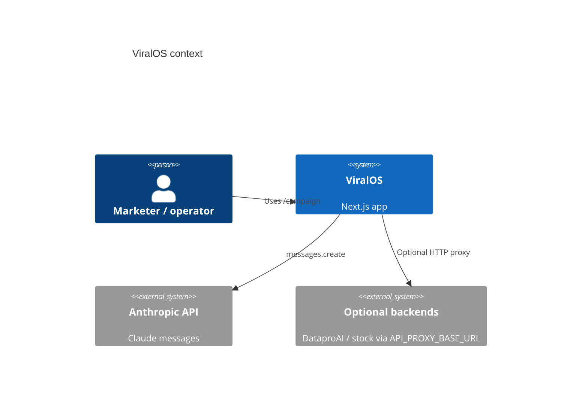

# ViralOS — System Design Architecture

> **Version**: 2026-05-27 · **Code HEAD**: `f03bf28`  
> **Companion**: [system-interaction-design.md](./system-interaction-design.md) · [system-control-data-flow.md](./system-control-data-flow.md) · [DESIGN.md](./DESIGN.md)

This document describes **what ViralOS is** — layers, components, deployment, and boundaries. For sequences and APIs, see the interaction doc. For agent pipeline control/data transforms, see the control/data flow doc.

---

## 1. Purpose & scope

**ViralOS** is an **AI-native viral marketing campaign generator**. A user supplies product context; the system runs three specialized LLM agents in sequence and returns persona research, platform-native content, and a virality score.

| Goal | Mechanism |
|------|-----------|
| Fast campaign generation | Sequential 3-agent pipeline (~30s typical) |
| Real-time UX | Server-Sent Events (SSE) from `POST /api/campaign` |
| Multi-platform output | Content Writer agent keyed by platform list |
| Self-host / Vercel | Next.js 14 **Pages Router** (not App Router) |

**In scope (this repo)**

- Campaign UI (`/campaign`)
- Campaign API (`/api/campaign`)
- Campaign engine (`lib/campaign.js`)
- Optional HTTP proxies (`lib/proxy.js`, legacy DataproAI routes)

**Out of scope (documented only)**

- Personal Cognitive OS (WeChat HCI) — `docs/hci-*.md`, not implemented here
- Persistent user accounts / campaign history DB
- Published `@viralOS/sdk` package (separate repo / npm)

---

## 2. System context



---

## 3. Layered architecture

```text
┌─────────────────────────────────────────────────────────────────┐
│ L1 Presentation                                                  │
│   pages/index.js          Landing                                │
│   pages/campaign.js       Form + SSE client + result panel       │
├─────────────────────────────────────────────────────────────────┤
│ L2 API (Pages Router)                                            │
│   pages/api/campaign.js   GET metadata · POST SSE stream         │
│   pages/api/*             Optional catch-all proxies             │
├─────────────────────────────────────────────────────────────────┤
│ L3 Domain / orchestration                                        │
│   lib/campaign.js         streamCampaign · runAgent · AGENTS     │
├─────────────────────────────────────────────────────────────────┤
│ L4 Integration                                                   │
│   @anthropic-ai/sdk       Claude Sonnet                          │
│   lib/proxy.js            Env-based upstream forwarding          │
└─────────────────────────────────────────────────────────────────┘
```

**Routing rule:** API handlers live under `pages/api/`, not repo-root `/api/` (Pages Router requirement).

---

## 4. Core components

### 4.1 Campaign UI (`pages/campaign.js`)

| Aspect | Design |
|--------|--------|
| State | Local React state (`product`, `platforms`, `events`, `result`) |
| Transport | `fetch` + `ReadableStream` SSE parser |
| Persistence | None (ephemeral session) |

### 4.2 Campaign API (`pages/api/campaign.js`)

| Method | Behavior |
|--------|----------|
| `GET` | Returns `CAMPAIGN_API_INFO` JSON |
| `POST` | Validates `product`, checks `ANTHROPIC_API_KEY`, opens SSE, calls `streamCampaign` |

### 4.3 Campaign engine (`lib/campaign.js`)

| Agent | Role | Output shape (JSON) |
|-------|------|---------------------|
| `marketAnalyst` | Persona & emotional drivers | `persona`, `emotionalDrivers`, `competitorGap` |
| `contentWriter` | Platform posts | Per-platform keys (twitter, tiktok, xiaohongshu, …) |
| `growthOptimizer` | Score & distribution | `viralScore`, `scoreBreakdown`, `growthStrategy`, `boostTips`, `timing` |

Orchestration is **strictly sequential** — each agent consumes prior outputs in prompts.

### 4.4 Optional proxy layer

| Route pattern | Upstream | Env |
|---------------|----------|-----|
| `pages/api/dataproai/[[...slug]]` | DataproAI gateway | `API_PROXY_BASE_URL` |
| `pages/api/stock/[[...slug]]` | Stock API | same |
| `pages/api/social-media-content/[[...slug]]` | Content API | same |

Returns `503` with hint when `API_PROXY_BASE_URL` is unset.

---

## 5. Data architecture

ViralOS **does not** operate a first-party database for campaigns.

| Data | Location | Lifetime |
|------|----------|----------|
| User input | Request body → handler | Request |
| Agent intermediates | SSE events + in-memory during `streamCampaign` | Request |
| Final package | SSE `complete` event | Client state until refresh |
| API key | `process.env.ANTHROPIC_API_KEY` | Server env |

**Implication:** no server-side campaign history, audit trail, or multi-tenant isolation beyond deployment env.

---

## 6. Deployment

### 6.1 Environment variables

| Variable | Required | Purpose |
|----------|----------|---------|
| `ANTHROPIC_API_KEY` | **Yes** (campaign) | Claude API auth |
| `API_PROXY_BASE_URL` | No | Enable legacy proxy routes |

### 6.2 Build & runtime

```bash
npm install
npm run build    # next build (Pages Router)
npm start        # next start
```

**Vercel:** root `vercel.json` must match this Next app (not inherited from another project). API routes under `pages/api/`.

### 6.3 Verification gates

| Command | Covers |
|---------|--------|
| `npm run verify` | `next build` + `campaign-lib.test.mjs` |
| `npm run verify:full` | + `smoke-with-server.mjs` (HTTP SSE E2E) |

---

## 7. Security & trust boundaries

| Topic | Current design |
|-------|----------------|
| Authentication | None on campaign API (public POST if deployed) |
| Authorization | N/A |
| API key | Server-only `ANTHROPIC_API_KEY` |
| CORS | SSE response sets `Access-Control-Allow-Origin: *` |
| Input validation | `product` required; other fields optional strings/arrays |
| LLM output | Parsed JSON; parse failures return `{ error, raw }` in agent payload |

**Production recommendation:** add rate limiting, API key or session auth, and restrict CORS if exposed publicly.

---

## 8. Non-goals & future architecture (Cognitive OS)

The hci-* docs describe a separate **Personal Cognitive OS** (WeChat ingestion, cognitive storage, MCP). That stack is **not** merged into the shipped campaign pipeline. See [cognitive-os-mvp-canonical.md](./cognitive-os-mvp-canonical.md) for a bounded future MVP.

---

## 9. Document navigation

| Need | Read |
|------|------|
| User journeys & API | [system-interaction-design.md](./system-interaction-design.md) |
| Agent control/data flow | [system-control-data-flow.md](./system-control-data-flow.md) |
| Index | [DESIGN.md](./DESIGN.md) |
| Deploy retro | [issue.md](./issue.md) |
