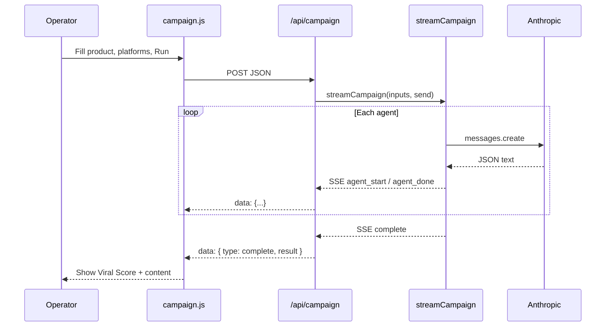
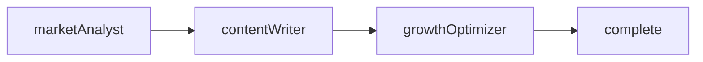

# ViralOS — System Interaction Design

> **Version**: 2026-05-27 · **Code HEAD**: `50d96cc`  
> **Companion**: [system-design-architecture.md](./system-design-architecture.md) · [system-control-data-flow.md](./system-control-data-flow.md)

This document describes **how actors interact** — user journeys, request sequences, SSE event contracts, and failure modes.

---

## 1. Actors & boundaries

| Actor | Description | Interface |
|-------|-------------|-----------|
| **Operator** | Human marketer | Browser → `/campaign` |
| **Campaign UI** | React page | `fetch('/api/campaign')` + stream reader |
| **Campaign API** | Next.js API route | HTTP GET/POST |
| **Campaign engine** | `streamCampaign` | In-process calls |
| **Anthropic** | Claude provider | `messages.create` |
| **Optional proxy** | DataproAI / stock | `lib/proxy.js` |



---

## 2. Pages & routes

| Path | Method | Role |
|------|--------|------|
| `/` | GET | Landing → link to `/campaign` |
| `/campaign` | GET | Campaign generator UI |
| `/api/campaign` | GET | API metadata (`CAMPAIGN_API_INFO`) |
| `/api/campaign` | POST | Start campaign generation (SSE) |

Legacy (optional): `/api/dataproai/*`, `/api/stock/*`, `/api/social-media-content/*` — require `API_PROXY_BASE_URL`.

---

## 3. User journey: Generate campaign

### 3.1 Happy path

1. Operator opens `/campaign`.
2. Enters **product** (required), description, audience, tone, comma-separated **platforms**.
3. Clicks generate → UI sets `loading`, clears prior `events` / `result`.
4. UI `POST`s JSON to `/api/campaign`.
5. UI reads SSE chunks; appends each parsed event to `events`.
6. On `agent_start` / `agent_done`, UI may show per-agent progress (event log).
7. On `type: complete`, UI sets `result` from `payload.result`.
8. `loading` cleared.

### 3.2 Failure paths

| Condition | HTTP / event | UI behavior |
|-----------|--------------|-------------|
| Missing `product` | `400` JSON `{ error }` | `response.ok` false → `setError` |
| Missing `ANTHROPIC_API_KEY` | `503` JSON + `hint` | Same |
| Wrong method | `405` | Same |
| LLM / network error | SSE `{ type: 'error', message }` | Parse throws → `setError` |
| Non-JSON agent output | `agent_done` with `{ error: 'Parse failed', raw }` | Still shown in events; `complete` may lack fields |

---

## 4. API contracts

### 4.1 `GET /api/campaign`

**Response** `200 application/json`:

```json
{
  "name": "ViralOS Campaign API",
  "version": "1.0.0",
  "endpoints": { "POST /api/campaign": "Generate viral campaign via streaming SSE" }
}
```

### 4.2 `POST /api/campaign`

**Request** `Content-Type: application/json`

| Field | Type | Required | Description |
|-------|------|----------|-------------|
| `product` | string | **Yes** | Product name |
| `description` | string | No | Product description |
| `audience` | string | No | Target audience |
| `tone` | string | No | Default `viral` |
| `platforms` | string[] | No | e.g. `["twitter","tiktok","xiaohongshu"]` |

**Success** `200` with headers:

```http
Content-Type: text/event-stream
Cache-Control: no-cache, no-transform
Connection: keep-alive
Access-Control-Allow-Origin: *
```

**Body:** SSE lines `data: <json>\n\n` (see §5).

### 4.3 Proxy routes (optional)

`proxyRequest(req, res, upstreamPath)` forwards method, body, and auth headers to `{API_PROXY_BASE_URL}{upstreamPath}/{slug}`.

| Status | Meaning |
|--------|---------|
| `503` | `API_PROXY_BASE_URL` not set |
| `502` | Upstream fetch failed |
| *other* | Pass-through from upstream |

---

## 5. SSE event contract

All events are JSON objects on `data:` lines.

| `type` | When | Key fields |
|--------|------|------------|
| `agent_start` | Before agent LLM call | `agent`, `name` |
| `agent_done` | After agent completes | `agent`, `data` (parsed JSON or parse error) |
| `complete` | Pipeline finished | `result` (aggregated campaign package) |
| `error` | Uncaught exception in handler | `message` |

### 5.1 `complete.result` shape

| Field | Source agent |
|-------|----------------|
| `product` | Input echo |
| `persona`, `emotionalDrivers` | marketAnalyst |
| `content` | contentWriter |
| `viralScore`, `scoreBreakdown`, `growthStrategy`, `boostTips`, `timing` | growthOptimizer |

### 5.2 Client parsing (UI)

The UI buffers stream chunks, splits on `\n\n`, reads lines starting with `data:`, and `JSON.parse`s the payload after the prefix. Partial chunks stay in `buffer` until a full event arrives.

---

## 6. Agent interaction order

Agents **do not** run in parallel. Each step waits for the previous LLM response.



| Step | Consumes | Produces (in prompt chain) |
|------|----------|----------------------------|
| 1 | User product fields | `marketData` |
| 2 | `marketData.persona` | `contentData` |
| 3 | `contentData` preview | `growthData` |
| 4 | All above | `result` object in `complete` |

---

## 7. SDK / external clients

The README documents `@viralOS/sdk` with `CampaignDirector` and `onProgress` callbacks. That SDK mirrors the same logical agent sequence; the **shipped repo** implements the server path in `lib/campaign.js`.

External clients may:

- Call `POST /api/campaign` and parse SSE identically to the UI.
- Import `streamCampaign` in Node tests with injected `createClient` (see `scripts/campaign-lib.test.mjs`).

---

## 8. Failure modes & operations

| Symptom | Likely cause | Mitigation |
|---------|--------------|------------|
| 404 on `/api/campaign` | Handler not under `pages/api/` | Use Pages Router path |
| 503 on POST | Missing `ANTHROPIC_API_KEY` | Set in `.env.local` / Vercel |
| Empty SSE | Proxy buffering | `Cache-Control: no-cache`; Vercel SSE limits |
| `Parse failed` in agent_done | Model returned non-JSON | Tighten prompts; retry |
| Proxy 503 | `API_PROXY_BASE_URL` unset | Set env or disable route |

Deploy issues: [issue.md](./issue.md).

---

## 9. Related documents

| Topic | Document |
|-------|----------|
| Layers & deployment | [system-design-architecture.md](./system-design-architecture.md) |
| Control flow & data transforms | [system-control-data-flow.md](./system-control-data-flow.md) |
| Design index | [DESIGN.md](./DESIGN.md) |
